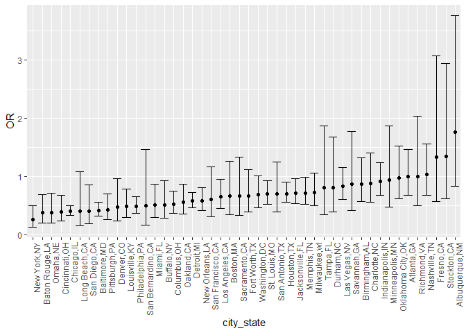

p8105_hw6_mc5503
================
mc5503
2023-11-27

## Problem 2

``` r
weather_df = 
  rnoaa::meteo_pull_monitors(
    c("USW00094728"),
    var = c("PRCP", "TMIN", "TMAX"), 
    date_min = "2022-01-01",
    date_max = "2022-12-31") |>
  mutate(
    name = recode(id, USW00094728 = "CentralPark_NY"),
    tmin = tmin / 10,
    tmax = tmax / 10) |>
  select(name, id, everything())
```

    ## using cached file: C:\Users\24233\AppData\Local/R/cache/R/rnoaa/noaa_ghcnd/USW00094728.dly

    ## date created (size, mb): 2023-11-26 19:27:44.573019 (8.561)

    ## file min/max dates: 1869-01-01 / 2023-11-30

``` r
boot_sample=function(df) {
  sample_frac(df, replace = TRUE)
}
boot_straps = 
  tibble(strap_number = 1:5000) |> 
  mutate(
    strap_sample = map(strap_number, \(i) boot_sample(df = weather_df))
  )
```

``` r
bootstrap_results = 
  boot_straps |> 
  mutate(
    models = map(strap_sample, \(df) lm(tmax ~ tmin+prcp, data = df) ),
    results1 = map(models, broom::tidy),
    results2=map(models,broom::glance))|> 
  select(-strap_sample, -models) |> 
  unnest(results1,results2)
```

``` r
results=bootstrap_results |> 
  select(strap_number,term,estimate,r.squared)|>
  pivot_wider(names_from = term,
              values_from = estimate)|>
  mutate(quantity2=log(tmin*prcp))
```

    ## Warning: There was 1 warning in `mutate()`.
    ## ℹ In argument: `quantity2 = log(tmin * prcp)`.
    ## Caused by warning in `log()`:
    ## ! 产生了NaNs

``` r
results|>ggplot(aes(x=r.squared))+geom_histogram()
```

    ## `stat_bin()` using `bins = 30`. Pick better value with `binwidth`.

<!-- -->

``` r
results|>ggplot(aes(x=quantity2))+geom_histogram()+labs(x="log(beta1*beta2)")
```

    ## `stat_bin()` using `bins = 30`. Pick better value with `binwidth`.

    ## Warning: Removed 3332 rows containing non-finite values (`stat_bin()`).

<!-- -->

``` r
results|>pull(r.squared)|>quantile(0.025)
```

    ##      2.5% 
    ## 0.8884894

``` r
results|>pull(r.squared)|>quantile(0.975)
```

    ##     97.5% 
    ## 0.9411243

``` r
results|>pull(quantity2)|>na.omit()|>quantile(0.025)
```

    ##      2.5% 
    ## -9.031616

``` r
results|>pull(quantity2)|>na.omit()|>quantile(0.975)
```

    ##     97.5% 
    ## -4.557664

The confidence interval for the first quantity is \[0.8884894,
0.9411243\], and the confidence interval for the second quantity is
\[-9.0316162, -4.5576645\]. NAs are omitted.
