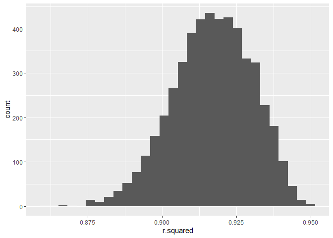
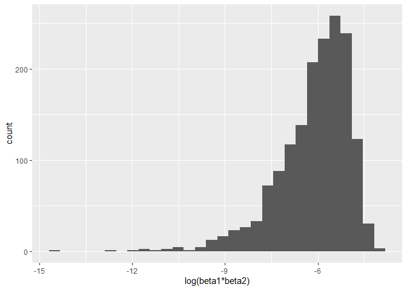
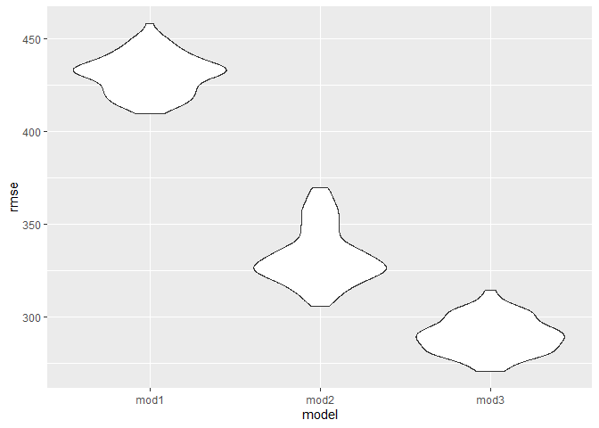

p8105_hw6_mc5503
================
mc5503
2023-11-27

## Problem 1

### data cleaning

``` r
data1=read_csv("data/homicide-data.csv",na = c("", "NA", "Unknown"))|>janitor::clean_names()
```

    ## Rows: 52179 Columns: 12
    ## ── Column specification ────────────────────────────────────────────────────────
    ## Delimiter: ","
    ## chr (8): uid, victim_last, victim_first, victim_race, victim_sex, city, stat...
    ## dbl (4): reported_date, victim_age, lat, lon
    ## 
    ## ℹ Use `spec()` to retrieve the full column specification for this data.
    ## ℹ Specify the column types or set `show_col_types = FALSE` to quiet this message.

``` r
data1=data1|>mutate(city_state=paste(city,state,sep = ","))|>
  mutate(status = case_when(
      disposition == "Closed without arrest" ~ 0,
      disposition == "Open/No arrest"        ~ 0,
      disposition == "Closed by arrest"      ~ 1))|>
  filter(!(city %in% c("Dallas","Phoenix","Kansas City","Tulsa")))|>
  filter(victim_race %in% c("White","Black"))|>
  mutate(victim_age=as.numeric(victim_age))|>
  select(city_state, status, victim_age, victim_sex, victim_race)
```

### glm for baltimore

``` r
baltimore_glm = 
  filter(data1,city_state == "Baltimore,MD")|> 
  glm(status ~ victim_age + victim_sex + victim_race, family = binomial(), data = _)

baltimore_glm |> 
  broom::tidy()|>
  mutate(
    OR = exp(estimate), 
    CI_upper = exp(estimate+1.96*std.error),
    CI_lower = exp(estimate-1.96*std.error))|> 
  filter(term == "victim_sexMale")|> 
  select(OR, CI_lower,CI_upper)|>
  knitr::kable()
```

|        OR | CI_lower |  CI_upper |
|----------:|---------:|----------:|
| 0.4255117 | 0.324559 | 0.5578655 |

### fit glm for all

``` r
model_results = 
  data1|> 
  nest(data = -city_state)|>
  mutate(
    models = map(data, \(df) glm(status ~ victim_age +victim_sex +victim_race, 
                             family = binomial(), data = df)),
    tidy_models = map(models,broom::tidy)) |> 
  select(-models,-data) |> 
  unnest(cols = tidy_models)|> 
  mutate(
    OR = exp(estimate), 
    CI_upper = exp(estimate + 1.96 * std.error),
    CI_lower = exp(estimate - 1.96 * std.error)) |> 
  filter(term == "victim_sexMale") |> 
  select(city_state,OR,CI_lower,CI_upper)

model_results|> 
  knitr::kable()
```

| city_state        |        OR |  CI_lower |  CI_upper |
|:------------------|----------:|----------:|----------:|
| Albuquerque,NM    | 1.7674995 | 0.8306583 | 3.7609380 |
| Atlanta,GA        | 1.0000771 | 0.6836012 | 1.4630669 |
| Baltimore,MD      | 0.4255117 | 0.3245590 | 0.5578655 |
| Baton Rouge,LA    | 0.3814393 | 0.2092532 | 0.6953103 |
| Birmingham,AL     | 0.8700153 | 0.5742951 | 1.3180098 |
| Boston,MA         | 0.6673219 | 0.3535003 | 1.2597401 |
| Buffalo,NY        | 0.5205704 | 0.2897705 | 0.9352008 |
| Charlotte,NC      | 0.8838976 | 0.5569929 | 1.4026659 |
| Chicago,IL        | 0.4100982 | 0.3359897 | 0.5005527 |
| Cincinnati,OH     | 0.3998277 | 0.2360847 | 0.6771390 |
| Columbus,OH       | 0.5324845 | 0.3782581 | 0.7495933 |
| Denver,CO         | 0.4790620 | 0.2364294 | 0.9706934 |
| Detroit,MI        | 0.5823472 | 0.4622017 | 0.7337235 |
| Durham,NC         | 0.8123514 | 0.3920374 | 1.6832957 |
| Fort Worth,TX     | 0.6689803 | 0.3969391 | 1.1274643 |
| Fresno,CA         | 1.3351647 | 0.5804995 | 3.0709150 |
| Houston,TX        | 0.7110264 | 0.5576715 | 0.9065526 |
| Indianapolis,IN   | 0.9187284 | 0.6794344 | 1.2423006 |
| Jacksonville,FL   | 0.7198144 | 0.5365350 | 0.9657017 |
| Las Vegas,NV      | 0.8373078 | 0.6076753 | 1.1537154 |
| Long Beach,CA     | 0.4102163 | 0.1555148 | 1.0820672 |
| Los Angeles,CA    | 0.6618816 | 0.4581299 | 0.9562510 |
| Louisville,KY     | 0.4905546 | 0.3047208 | 0.7897189 |
| Memphis,TN        | 0.7232194 | 0.5291729 | 0.9884224 |
| Miami,FL          | 0.5152379 | 0.3044831 | 0.8718716 |
| Milwaukee,wI      | 0.7271327 | 0.4987091 | 1.0601810 |
| Minneapolis,MN    | 0.9469587 | 0.4782860 | 1.8748838 |
| Nashville,TN      | 1.0342379 | 0.6847143 | 1.5621816 |
| New Orleans,LA    | 0.5849373 | 0.4217648 | 0.8112381 |
| New York,NY       | 0.2623978 | 0.1379459 | 0.4991275 |
| Oakland,CA        | 0.5630819 | 0.3650924 | 0.8684409 |
| Oklahoma City,OK  | 0.9740747 | 0.6240860 | 1.5203378 |
| Omaha,NE          | 0.3824861 | 0.2029670 | 0.7207853 |
| Philadelphia,PA   | 0.4962756 | 0.3776157 | 0.6522225 |
| Pittsburgh,PA     | 0.4307528 | 0.2650983 | 0.6999213 |
| Richmond,VA       | 1.0060520 | 0.4979508 | 2.0326120 |
| San Antonio,TX    | 0.7046200 | 0.3976578 | 1.2485342 |
| Sacramento,CA     | 0.6688418 | 0.3347139 | 1.3365127 |
| Savannah,GA       | 0.8669817 | 0.4222665 | 1.7800544 |
| San Bernardino,CA | 0.5003444 | 0.1712084 | 1.4622204 |
| San Diego,CA      | 0.4130248 | 0.1995220 | 0.8549909 |
| San Francisco,CA  | 0.6075362 | 0.3167902 | 1.1651253 |
| St. Louis,MO      | 0.7031665 | 0.5303670 | 0.9322661 |
| Stockton,CA       | 1.3517273 | 0.6211368 | 2.9416496 |
| Tampa,FL          | 0.8077029 | 0.3477529 | 1.8759988 |
| Washington,DC     | 0.6910490 | 0.4690002 | 1.0182272 |

### plot

``` r
model_results |> 
  mutate(city_state=fct_reorder(city_state, OR)) |> 
  ggplot(aes(x =city_state,y =OR)) + 
  geom_point() + 
  geom_errorbar(aes(ymin =CI_lower,ymax =CI_upper)) + 
  theme(axis.text.x =element_text(angle = 90, hjust = 1))
```

<!-- -->

## Problem 2

``` r
weather_df = 
  rnoaa::meteo_pull_monitors(
    c("USW00094728"),
    var = c("PRCP", "TMIN", "TMAX"), 
    date_min = "2022-01-01",
    date_max = "2022-12-31") |>
  mutate(
    name = recode(id, USW00094728 = "CentralPark_NY"),
    tmin = tmin / 10,
    tmax = tmax / 10) |>
  select(name, id, everything())
```

    ## using cached file: C:\Users\24233\AppData\Local/R/cache/R/rnoaa/noaa_ghcnd/USW00094728.dly

    ## date created (size, mb): 2023-11-26 19:27:44.573019 (8.561)

    ## file min/max dates: 1869-01-01 / 2023-11-30

``` r
boot_sample=function(df) {
  sample_frac(df, replace = TRUE)
}
boot_straps = 
  tibble(strap_number = 1:5000) |> 
  mutate(
    strap_sample = map(strap_number, \(i) boot_sample(df = weather_df))
  )
```

``` r
bootstrap_results = 
  boot_straps |> 
  mutate(
    models = map(strap_sample, \(df) lm(tmax ~ tmin+prcp, data = df) ),
    results1 = map(models, broom::tidy),
    results2=map(models,broom::glance))|> 
  select(-strap_sample, -models) |> 
  unnest(results1,results2)
```

``` r
results=bootstrap_results |> 
  select(strap_number,term,estimate,r.squared)|>
  pivot_wider(names_from = term,
              values_from = estimate)|>
  mutate(quantity2=log(tmin*prcp))
```

    ## Warning: There was 1 warning in `mutate()`.
    ## ℹ In argument: `quantity2 = log(tmin * prcp)`.
    ## Caused by warning in `log()`:
    ## ! 产生了NaNs

``` r
results|>ggplot(aes(x=r.squared))+geom_histogram()
```

    ## `stat_bin()` using `bins = 30`. Pick better value with `binwidth`.

<!-- -->

``` r
results|>ggplot(aes(x=quantity2))+geom_histogram()+labs(x="log(beta1*beta2)")
```

    ## `stat_bin()` using `bins = 30`. Pick better value with `binwidth`.

    ## Warning: Removed 3365 rows containing non-finite values (`stat_bin()`).

<!-- -->

``` r
results|>pull(r.squared)|>quantile(0.025)
```

    ##      2.5% 
    ## 0.8894759

``` r
results|>pull(r.squared)|>quantile(0.975)
```

    ##     97.5% 
    ## 0.9401113

``` r
results|>pull(quantity2)|>na.omit()|>quantile(0.025)
```

    ##      2.5% 
    ## -8.912719

``` r
results|>pull(quantity2)|>na.omit()|>quantile(0.975)
```

    ##     97.5% 
    ## -4.599651

The confidence interval for the first quantity is \[0.8894759,
0.9401113\], and the confidence interval for the second quantity is
\[-8.9127186, -4.5996507\]. NAs are omitted.

## Problem 3

``` r
data3=read.csv("data/birthweight.csv")|>
  mutate(babysex=recode(babysex,"1"="male","2"="female"),
         mrace=recode(mrace,"1" = "White", "2" = "Black", "3" = "Asian", '4' = "Puerto Rican", "8" = "Other"),
         frace=recode(frace,"1" = "White", "2" = "Black", "3" = "Asian", '4' = "Puerto Rican", '8' = "Other", "9" ="Unknown"))|>
  drop_na()
```

### fit the model

It’s reasonable to think that child’s weight is directly relative to
mom’s body index and health condition, gestational age and the the
income, so I include all of those variables into the model. Then delete
those variables which are not significant.

``` r
fit=lm(bwt~fincome+gaweeks+malform+momage+mrace+ppbmi+smoken+wtgain,data3)
broom::tidy(fit)
```

    ## # A tibble: 11 × 5
    ##    term              estimate std.error statistic   p.value
    ##    <chr>                <dbl>     <dbl>     <dbl>     <dbl>
    ##  1 (Intercept)        346.      118.        2.92  3.55e-  3
    ##  2 fincome              0.519     0.281     1.85  6.47e-  2
    ##  3 gaweeks             53.3       2.13     25.0   1.11e-128
    ##  4 malform            -45.8     111.       -0.412 6.80e-  1
    ##  5 momage               2.58      1.88      1.37  1.69e-  1
    ##  6 mraceBlack        -160.       67.7      -2.36  1.82e-  2
    ##  7 mracePuerto Rican  -57.6      72.2      -0.798 4.25e-  1
    ##  8 mraceWhite         122.       67.1       1.82  6.91e-  2
    ##  9 ppbmi               20.0       2.09      9.56  1.99e- 21
    ## 10 smoken             -11.4       0.911   -12.5   3.83e- 35
    ## 11 wtgain              10.1       0.610    16.5   2.78e- 59

``` r
fit=lm(bwt~fincome+gaweeks+mrace+ppbmi+smoken+wtgain,data3)
broom::tidy(fit)
```

    ## # A tibble: 9 × 5
    ##   term              estimate std.error statistic   p.value
    ##   <chr>                <dbl>     <dbl>     <dbl>     <dbl>
    ## 1 (Intercept)        396.      113.         3.52 4.34e-  4
    ## 2 fincome              0.605     0.274      2.21 2.74e-  2
    ## 3 gaweeks             53.5       2.13      25.1  7.56e-130
    ## 4 mraceBlack        -177.       66.6       -2.65 7.99e-  3
    ## 5 mracePuerto Rican  -72.1      71.4       -1.01 3.13e-  1
    ## 6 mraceWhite         110.       66.6        1.66 9.76e-  2
    ## 7 ppbmi               20.3       2.08       9.77 2.63e- 22
    ## 8 smoken             -11.4       0.911    -12.5  3.25e- 35
    ## 9 wtgain               9.97      0.607     16.4  7.15e- 59

``` r
results_data=modelr::add_residuals(data3, fit)|>modelr::add_predictions(fit)

results_data|>ggplot(aes(x=pred,y=resid))+geom_point()
```

<!-- -->

There is no heteroscedasticity according to the graph.

``` r
fit1=lm(bwt~gaweeks+blength,data3)
broom::tidy(fit1)
```

    ## # A tibble: 3 × 5
    ##   term        estimate std.error statistic  p.value
    ##   <chr>          <dbl>     <dbl>     <dbl>    <dbl>
    ## 1 (Intercept)  -4348.      98.0      -44.4 0       
    ## 2 gaweeks         27.0      1.72      15.7 2.36e-54
    ## 3 blength        129.       1.99      64.6 0

``` r
fit2=lm(bwt~bhead*blength*babysex,data3)
broom::tidy(fit2)
```

    ## # A tibble: 8 × 5
    ##   term                      estimate std.error statistic    p.value
    ##   <chr>                        <dbl>     <dbl>     <dbl>      <dbl>
    ## 1 (Intercept)                -802.    1102.       -0.728 0.467     
    ## 2 bhead                       -16.6     34.1      -0.487 0.626     
    ## 3 blength                     -21.6     23.4      -0.926 0.354     
    ## 4 babysexmale               -6375.    1678.       -3.80  0.000147  
    ## 5 bhead:blength                 3.32     0.713     4.67  0.00000317
    ## 6 bhead:babysexmale           198.      51.1       3.88  0.000105  
    ## 7 blength:babysexmale         124.      35.1       3.52  0.000429  
    ## 8 bhead:blength:babysexmale    -3.88     1.06     -3.67  0.000245

``` r
cv_df = 
  crossv_mc(data3, 100) 

cv_df =
  cv_df |> 
  mutate(
    train = map(train, as_tibble),
    test = map(test, as_tibble))
```

``` r
cv_df = 
  cv_df |> 
  mutate(
    mod1  = map(train, \(df) lm(bwt~fincome+gaweeks+mrace+ppbmi+smoken+wtgain,df)),
    mod2  = map(train, \(df) lm(bwt~gaweeks+blength,df)),
    mod3  = map(train, \(df) lm(bwt~bhead*blength*babysex,df))) |> 
  mutate(
    rmse_mod1 = map2_dbl(mod1, test, \(mod, df) rmse(model = mod, data = df)),
    rmse_mod2 = map2_dbl(mod2, test, \(mod, df) rmse(model = mod, data = df)),
    rmse_mod3 = map2_dbl(mod3, test, \(mod, df) rmse(model = mod, data = df)))
```

``` r
cv_df |> 
  select(starts_with("rmse")) |> 
  pivot_longer(
    everything(),
    names_to = "model", 
    values_to = "rmse",
    names_prefix = "rmse_") |> 
  mutate(model = fct_inorder(model)) |> 
  ggplot(aes(x = model, y = rmse)) + geom_violin()
```

<!-- -->

Since my model does not contain baby’s body index, the prediction is not
so efficient as two others. Model using head circumference, length, sex,
and all interactions is the optimal one.
